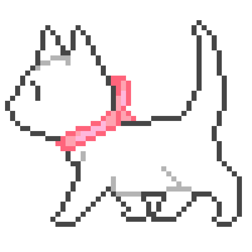

  

  
  
  

 

  

  <marquee behavior="scroll" direction="left" scrollamount="6" loop="infinite" width="100%">
    
  </marquee>

<h1 align="center">Hello World!!!</h1>

<h3 align="center">Bem-vindo(a) ao meu perfil</h3>

  Sou uma desenvolvedora Full Stack em formação na Fatec ZS, movida pela curiosidade, tecnologia e aprendizado constante. Aqui você encontrará alguns dos projetos que fazem parte da minha jornada na programação!

---

<h3>Sobre mim:</h3>

* 🎓 **Formação:** Desenvolvimento de Software Multiplataforma - **Fatec ZS** *(Previsão: JUL/2028)*
* 💼 **Atuação:** Estagiária de TI na **Subprefeitura de São Paulo**
* 🛠️ **Experiência Prática:** Criação de dashboards e automação de rotinas para servidores utilizando JS, TS, React, Tailwind e MySQL
* 💡 **Interesses:** Desenvolvimento Web, Engenharia de Software e Soluções com impacto real

---

<h3>Minhas Techs:</h3>

  

---

<h3>Minhas Estatísticas:</h3>

  
  

---

<h3>Alguns Projetos:</h3>

  
  

---

  
  
<i>"Sempre em busca do próximo bug para resolver." ☕</i>

